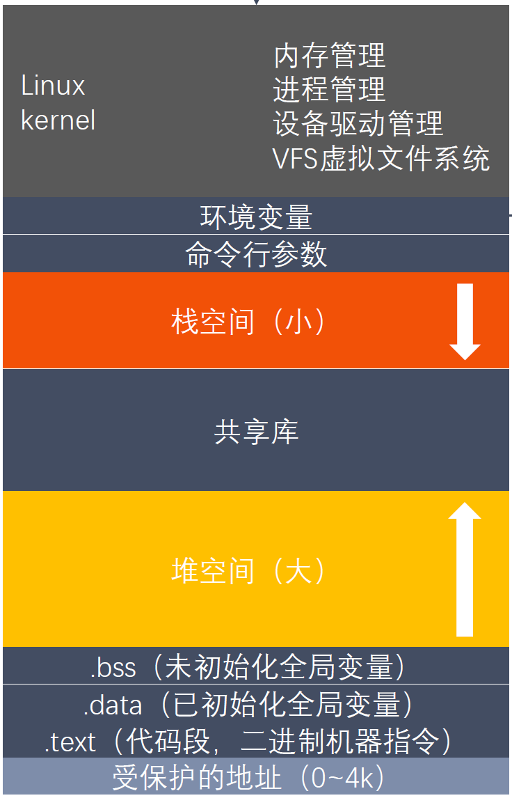

# 关于CPU和内存

## 程序加载进内存的过程

操作系统创建进程虚拟地址空间，把可执行文件和动态库映射到这个虚拟地址空间里；真正的物理内存通常在程序访问对应页面时才分配或读入

1. Shell 本身就是一个进程，fork出一个子进程，其地址空间被替换成新的程序
2. 内核读取可执行文件头，Linux下的可执行文件是ELF  
    什么是ELF，程序的一些描述信息
3. 内核创建进程**虚拟地址**空间
4. 对于动态链接程序，内核加载主程序后，不是直接跳到 main，而是先启动动态链接器
5. 符号解析、重定位，把程序里那些“编译时还不知道最终地址的函数/变量引用”，在运行时修正成真正可访问的虚拟地址。
6. 完整流程
    ```test
    用户输入 ./a.out
    |
    v
    Shell fork 子进程
    |
    v
    子进程 execve("./a.out")
    |
    v
    内核读取 ELF Header
    |
    v
    检查可执行文件格式、权限、架构
    |
    v
    创建新的进程虚拟地址空间
    |
    v
    映射 .text / .rodata / .data / .bss
    |
    v
    创建 stack，放入 argc / argv / envp
    |
    v
    初始化 heap 区域
    |
    v
    映射动态链接器 ld-linux
    |
    v
    切换到用户态，跳到动态链接器入口
    |
    v
    动态链接器加载 libc / libstdc++ / 其他 so
    |
    v
    符号解析、重定位、GOT/PLT 初始化
    |
    v
    调用全局对象构造函数
    |
    v
    进入 _start / __libc_start_main
    |
    v
    调用 main(argc, argv, envp)
    |
    v
    程序运行
    ```


## 虚拟内存空间(Virtual Memory Area)


程序里的地址通常是“字节地址”

由低到高分布如下，**注意这只是一个分布的概念**，他们并不是紧密相连的，中间有很大的空洞，尤其是在64位系统上

- 数据段
    - .text     代码段，机器码
    - .rodata   只读常量
    - .data     已初始化的全局对象
    - .bss      存未初始化或初始化为 0 的全局变量、静态变量，每个变量都有了合法的虚拟地址空间
        - 这些对象的初始化操作先于main函数的执行，而且这些对象（可能分布在不同的源文件中）初始化顺序没有规定，所以在它们的初始化中不要启动线程，同时它们的初始化操作也不应有依赖关系。

- 堆空间
    - 由低向高生长
    - 需要管理生存周期 -- 智能指针
    - 堆对象的时间效率和空间效率没有栈对象高，内存的创建需要算法辅助
    - 频繁申请/释放会导致内存碎片
    - **new/malloc，delete/free**

- 共享库
    - 栈和堆之间有一片 mmap 区域，共享库通常通过 mmap 映射到这片区域里
    - 动态库 libstdc++.so 会被动态链接器加载到当前进程的虚拟地址空间中
    - 动态库本质上也是文件中的代码和数据，需要被映射进进程，程序才能调用里面的函数
    
- 栈空间
    - 由高向低生长
    - 自生自灭型对象，无需对其生存周期进行管理
    - 临时对象、函数内的局部对象，栈对象高效，不需要进行内存搜索只进行**栈顶指针**的移动
    - 线程安全的，因为不同的线程有自己的栈内存
    - 空间有限，防止溢出，大的对象，递归函数等会遇到

- 内核地址
    - 每个进程的虚拟地址空间里，通常都映射了一部分内核地址。
    - 但是普通用户态代码不能访问这些地址。因为页表项里会标记权限
    - 如果内核地址本来就在当前进程页表里，只是权限不允许用户态访问，那么切到内核态之后，CPU 不需要完全换一套地址空间，就可以直接执行内核代码。

### 虚拟内存与物理内存
- VIRT 是进程虚拟地址空间的规模。
    - 它包括 arr 的整个虚拟地址范围。
    - arr[i] 的地址不是单独存的，而是通过：arr 起始地址 + i * sizeof(int)计算出来的。
    - 程序中的任何变量都是由一个或一段虚拟地址描述的
- RES/RSS 常驻内存大小，当前真实驻留在物理内存中的页
- SHR RES 中 可能被其他进程共享的部分

## CPU访问内存与Cache
### CPU的取指令
CPU 不认识 C++ 函数、类、变量名，它只执行机器指令。  

- CPU 执行时有一个关键寄存器：**RIP / EIP：指令指针寄存器**

- CPU 执行循环
    ```text
    1. 根据 RIP 取指令
    2. 解码指令
    3. 执行指令
    4. 更新 RIP
    5. 执行下一条
    ```
- CPU 要从虚拟地址 0x400560 取一条指令。
    ```text
    CPU 发出虚拟地址 0x400560
    ↓
    MMU 根据页表转换
    ↓
    虚拟地址 → 物理地址
    ↓
    从 L1/L2/L3 cache 或内存读取指令
    ↓
    送入 CPU 执行单元
    ```
- 如果页表里没有对应物理页：
    ```text
    触发 page fault
    ↓
    进入内核
    ↓
    内核加载/分配物理页
    ↓
    更新页表
    ↓
    返回继续执行
    ```
- 函数调用本质是
    ```
    保存返回地址 → 修改 RIP → 执行目标函数 → ret 恢复 RIP
    ```
- 普通程序不能直接操作磁盘、网卡、文件系统、进程表。用户态库函数最终会触发系统调用：
    ```
    用户态
    ↓ syscall 指令
    进入内核态
    ↓
    内核检查权限
    ↓
    内核访问文件/磁盘/网络
    ↓
    把结果返回用户态
    ```

### Cache
Cache 是 CPU 和内存之间的高速缓冲区，用来减少 CPU 等待内存的时间。解决CPU速度远远快于内存的问题
- 空间局部性
- 时间局部性
- 优化思路
    - 顺序访问内存
    - 使用连续容器
    - 减少对象膨胀(Cache line)
    - 避免伪共享
```
每个 CPU 核心
  ├── L1 Instruction Cache：缓存指令
  ├── L1 Data Cache：缓存数据
  └── L2 Cache：通常每个核心独享

多个核心共享
  └── L3 Cache：通常多个核心共享
```

- Cache之间的数据搬运
    - Cache 不是按一个字节加载，而是按 Cache Line 加载，常见的大小是64字节
    ```
    Cache 之间的数据搬运：CPU 内部的 cache controller 负责
    内存到 CPU cache 的搬运：内存控制器 + cache controller 负责
    地址翻译：MMU/TLB 负责
    ```
- 数组比链表更 cache 友好，CPU 读一个元素，会顺便把后面一批元素加载进 Cache Line。
    ```
    1. Cache Line 加载的附近数据用不上
    2. 下一个节点地址要等当前节点读出来才知道
    3. 容易 cache miss
    4. CPU 预取器也难预测
    ```
- 行优先访问为什么比列优先访问快
    ```
    内层连续变化，访问的是连续内存。
    外层每次跳一整行，空间局部性差，cache line 利用率低。
    ```

### false sharing 伪共享
两个线程各自频繁访问的变量a，在同一个cache line里
```
多核 CPU 中，每个核心有自己的 L1/L2 Cache。
如果 Core 1 修改 a，它会让其他核心中同一 cache line 失效。
然后 Core 2 修改 b，又会让 Core 1 的 cache line 失效。
```
#### 解决方法  
**padding 或 alignas**，尽量保证不同线程频繁修改的数据不要落在同一个 cache line 里。
- alignas 是 C++11 引入的关键字，用来 指定变量、类型、结构体成员的对齐要求。

### Cache一致性
多核 CPU 的 cache 一致性和线程安全不是一回事。cache 一致性是硬件层面的，保证**同一条 cache line 在不同核心的缓存副本**之间保持一致，比如一个核心写入后，其他核心对应 cache line 会失效或更新。

但线程安全是程序语义层面的，它要求操作具备正确的原子性、可见性和顺序性。比如 count++ 即使 cache line 一致，也仍然可能发生**两个线程同时 load 旧值、分别加一**、再覆盖写回的问题。

所以 cache coherence 只能保证底层缓存不会长期不一致，但不能自动把复合操作变成原子操作，也不能替代 mutex、atomic 和内存序。
```
Cache 一致性解决的是“多个核心看到的内存副本是否一致”；
线程安全解决的是“多个线程交错执行时，程序逻辑是否正确”。
```

#### write-back cache
```
Core 1 写这条 cache line
其他核心的副本请失效

Core 1 Cache: x 所在 line，M，值为 2
Core 2 Cache: x 所在 line，I，无效
Memory: 可能还是旧值 1

Core 2 请求读取 x 所在 cache line
    ↓
一致性协议发现 Core 1 有 Modified 最新版本
    ↓
Core 1 把最新数据提供出来，或者写回下级 cache/内存
    ↓
Core 2 得到最新 cache line
```

### atomic 和 Cache
std::atomic 底层通常依赖 CPU 原子指令
```C++
std::atomic<int> x{0};
x.fetch_add(1);

当前核心必须独占 x 所在的 cache line
然后执行原子读-改-写
其他核心不能同时修改这个 cache line
```

atomic 不是没有成本,多个线程频繁操作同一个 atomic 变量时，会导致：
```
cache line 在多个核心之间来回迁移
总线/一致性流量增加
性能下降
```

### 内存屏障
### Cache miss
```
- Compulsory miss   冷启动 miss。
- Capacity miss     Cache 容量不够，数据被挤出去了。
- Conflict miss     不同内存地址可能竞争 Cache 中同一个位置，导致互相驱逐
```

## 操作系统内存管理
CPU的最小寻址单位是字节
### 页 page
操作系统一般按页管理内存。常见页大小是 4KB。虚拟内存和物理内存都是按照页表管理，并保持表内偏移量一致。

程序启动时，不需要把整个可执行文件全部读入物理内存，而是按需加载。
### 页表 page table
- 页表负责虚拟页到物理页框的映射；虚拟页号 VPN → 物理页框号 PFN
- 每个进程有自己的页表，如果 CPU 从进程 A 切到进程 B，当前页表会切换
- TLB 里原来缓存的 A 的地址翻译，对 B 可能是错的
### 缺页 page fault
- 懒分配
    ```text
    1. 进程申请虚拟地址空间。
    2. 物理页可能暂时没分配。
    3. 真正访问某一页时，触发 page fault。
    4. 内核分配物理页，并建立页表映射。
    5. 程序继续运行
    ```
### TLB
CPU 访问内存时先用 TLB/页表完成地址翻译，再去 Cache/内存取数据。

### CPU 寻址的完整链路
```
CPU 访问虚拟地址 VA
    ↓
拆成 VPN + offset
    ↓
查 TLB
    ↓
TLB hit？
    ├─ 是：
    │    得到 PFN
    │    PFN + offset = 物理地址
    │    访问 Cache / 内存
    │
    └─ 否：
         查页表
            ↓
         页表有有效映射？
            ├─ 是：
            │    填入 TLB
            │    得到物理地址
            │    访问 Cache / 内存
            │
            └─ 否：
                 page fault
                 交给内核处理
```


## new / malloc
### new
- 调用 operator new 分配原始内存。
- 在这块内存上调用构造函数
### malloc
- 只负责原始内存，不调用构造/析构

## 智能指针
## mmap

## 类与内存
- 空类
    - 空类本身没有数据，但对象必须有“身份”和“地址”；为了保证不同对象地址不同、数组元素地址可区分，C++ 规定空类完整对象大小至少是 1字节（最小寻址单位）。
    - 只有在作为空基类时，编译器才可能通过 EBO 把它优化成不额外占空间。
- 内存对齐
    - 让对象成员按照 CPU 更容易访问的地址边界摆放，用空间换访问效率和硬件兼容性。
    - 成员顺序会影响结构体大小，结构体成员一般按从大到小排列
### 类在内存里的分布
- 函数，
    - 都在代码区，函数再多，类的大小都不会有变化
    - 成员方法之所以能访问成员变量，是因为this函数的传入，
    - 静态成员函数没有this指针，所以也就不能访问非静态成员变量
- 成员变量
    - 静态成员在常量区或者静态变量区，不属于某个具体对象，因此也不会影响对象的大小，自然也不会参与padding，也不会参与构造函数
    - 内存里的类实际上只存放了成员变量和虚指针
### 继承与内存
子类会把基类的成员变量合在一起，一起通过this指针访问，所以**子类的内存大小=子类+基类**  
```
Derived 对象:
+-------------+
| Base::a     |
+-------------+
| Derived::b  |
+-------------+
```

- 虚指针
    - 虚表指针 vptr，很多实现会把它放在对象起始位置
    - 在构造对象时设置
- 虚表
    - 虚函数代码在代码段
    - 虚函数地址在虚表里
    - 虚表本质上是一块静态数据，通常位于程序或动态库的只读数据区
    - 虚表不是每创建一个对象就生成一份。通常一个类一张虚表，所有该类对象共享这一张虚表。
    ```text
    编译期：编译器知道这个类需要虚表，并生成虚表数据，编译器会对不同的虚函数分配不同的槽位，固定好了
    链接期：确定虚函数最终地址，完成重定位
    运行期：程序加载到内存，虚表进入进程地址空间，完成真正的地址映射；构造对象时把 vptr 指向对应虚表
    ```
    - 子类的虚表会包含
        1. 从基类继承来的虚函数表项
        2. 子类 override 后替换掉的函数地址
        3. 子类新增的虚函数表项（**基类指针只能调用基类接口里已有的虚函数**），指针在调用函数前首先会有静态类型检查，函数不在自己类内，当然不会调用

    - 虚表的整个流程
    ```
    编译期：
    1. 编译器发现 Base 有 virtual 函数
    2. 给 Base 生成虚表
    3. 给 Derived 生成虚表
    4. 在对象布局里加入 vptr
    5. 把 p->f() 编译成“通过 vptr 查虚表再调用”的逻辑

    链接期：
    1. 确定 Base::f、Derived::f 的符号位置
    2. 修正虚表中的函数地址引用

    加载期：
    1. 操作系统加载可执行文件和动态库
    2. 虚表随 .rodata / .data.rel.ro 等段进入进程虚拟地址空间
    3. 动态链接器完成必要的重定位

    运行期：
    1. new Derived() 分配对象内存
    2. 构造 Base 子对象，vptr 指向 Base 虚表
    3. 构造 Derived 部分，vptr 指向 Derived 虚表
    4. p->f() 时，通过对象里的 vptr 找到 Derived 虚表
    5. 从虚表中取出 Derived::f 地址
    6. 调用 Derived::f
    ```
### 对象的构造流程
- 普通对象
    ```text
    分配对象内存
        ↓
    初始化成员 x
        ↓
    初始化成员 s
        ↓
    进入 A() { ... } 构造函数体
    ```
- 继承的构造顺序
    ```text
    分配 Derived 对象整块内存
        ↓
    构造 Base 子对象, vptr 指向 Base 虚表
        ↓
    构造 Derived 的成员变量 m
        ↓
    执行 Derived 构造函数体
    ```

    - 构造函数体执行时，成员已经存在了
    - 成员变量实际初始化顺序永远按类中声明顺序
    - 初始化列表，直接构造；反之构造函数=构造+赋值
    - 引用、const 成员、没有默认构造函数的成员对象，都必须在初始化列表中初始化

### 内存池
todo

### 共享内存

### STL的内存行为